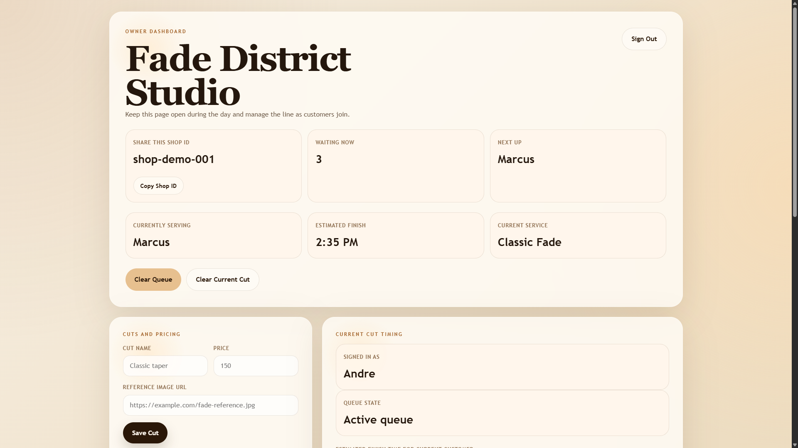
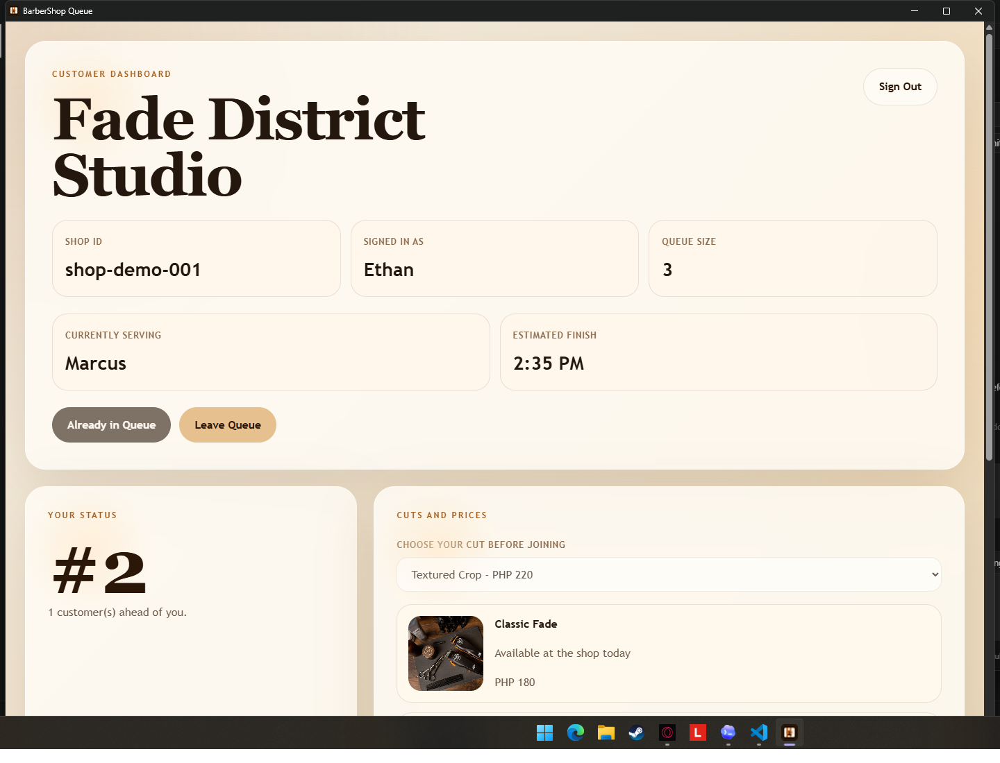

# BarberShop Queue

A real-time barbershop queue app built with React, Vite, Firebase Authentication, and Firestore.

Owners can:
- create a shop and share a shop ID
- manage a live queue
- add cuts, prices, and reference images
- set the current customer and estimated finish time

Customers can:
- join a shop with the shared shop ID
- pick a cut before joining the queue
- view cuts, prices, and style references
- see their live queue position and current finish estimate

## Screenshots

### Owner Dashboard



### Customer Dashboard



## Tech Stack

- React
- Vite
- Firebase Authentication
- Cloud Firestore
- PWA support

## Local Setup

1. Install dependencies:

```bash
npm install
```

2. Copy the example env file and fill in your Firebase project values:

```bash
cp .env.example .env.local
```

3. Start the dev server:

```bash
npm run dev
```

## Environment Variables

The app expects these variables:

```env
VITE_FIREBASE_API_KEY=
VITE_FIREBASE_AUTH_DOMAIN=
VITE_FIREBASE_PROJECT_ID=
VITE_FIREBASE_STORAGE_BUCKET=
VITE_FIREBASE_MESSAGING_SENDER_ID=
VITE_FIREBASE_APP_ID=
```

## Notes

- `.env.local` is ignored and should stay private.
- `.env.example` is safe to commit and share.
- Firestore rules and Google sign-in must be enabled in Firebase for the app to work correctly.
